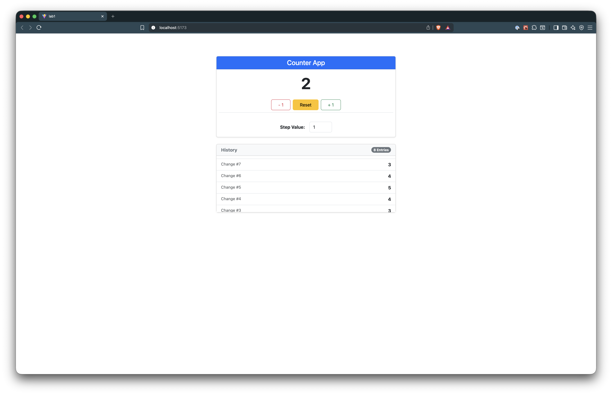
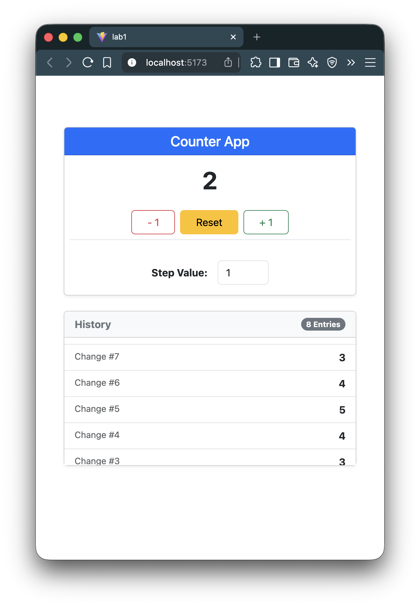

# 📋 Advanced Counter

A feature-rich, interactive counter application built with **React and TypeScript**, featuring **increment/decrement with custom steps, count history tracking, keyboard support, and localStorage persistence**. Perfect for practicing `useState` and `useEffect` with side effects and cleanup.

---

## 🌟 Features

* **Display Current Count** – Shows the current count and updates in real-time
* **Increment & Decrement Buttons** – Adjust the count by a customizable step value
* **Step Input** – Define the step value used by increment/decrement
* **Count History** – Keeps a full history of all count values
* **Auto-Save** – Saves current count and history to `localStorage` automatically
* **Keyboard Support** – Increment with `ArrowUp` and decrement with `ArrowDown` keys
* **Reset Function** – Reset count and history back to initial state
* **Persistent Data** – All count values and history persist across page reloads

---

## 📂 Project Structure

```
counter/
.
├── README.md
├── eslint.config.js
├── index.html
├── package-lock.json
├── package.json
├── public
│   ├── screenshots
│   │   ├── desktop.png
│   │   └── mobile.png
│   └── vite.svg
├── src
│   ├── App.css
│   ├── App.tsx
│   ├── assets
│   │   └── react.svg
│   ├── components
│   │   └── Counter.tsx
│   ├── index.css
│   └── main.tsx
├── tsconfig.app.json
├── tsconfig.json
├── tsconfig.node.json
└── vite.config.ts

6 directories, 18 files
```

---

## ⚡ How to Use

### Installation

1. Clone the repository or download the project files
2. Install dependencies:

   ```bash
   npm install
   ```

### Running the Application

1. Start the development server:

   ```bash
   npm run dev
   ```
2. Open your browser at the URL shown in the terminal (usually `http://localhost:5173`)

### Using the Counter

1. **Increment/Decrement Count:**

   * Use the buttons to increase or decrease the count by the step value
   * Or use the keyboard `ArrowUp` and `ArrowDown` keys

2. **Set Step Value:**

   * Change the step input to adjust how much each increment/decrement changes the count

3. **View Count History:**

   * Every change is saved to a history list
   * History persists even after page reloads

4. **Reset Counter:**

   * Click the "Reset" button to clear count and history

---

## 🚀 Live Demo

> 🌐 **Live Demo:** *[Click Here for Live Demo](https://mellifluous-alfajores-8c8468.netlify.app/)*

> 💻 **Repository:** *[View Source on GitHub](https://github.com/structbase/Counter)*

---

## 📸 Screenshots

### 🖥️ Desktop Layout



### 📱 Mobile Layout



---

## 🛠 Technologies Used

* **React 19.2** – Interactive UI library
* **TypeScript 5.9** – Type-safe JavaScript
* **Vite 7.2** – Fast build tool and development server
* **LocalStorage API** – Persistent client-side data

---

## 💡 Key Features Explained

### Counter Management

* **Increment/Decrement:** Adjust count by step using buttons or keyboard
* **Step Input:** Customize increment/decrement amount
* **History Tracking:** All count changes recorded and displayed
* **Auto-Save:** Persists count and history in `localStorage`

### Keyboard Support

* **ArrowUp:** Increases count
* **ArrowDown:** Decreases count
* Effect listeners are cleaned up on component unmount

### Reset & Persistence

* **Reset Button:** Resets count and clears history
* **Persistent Data:** Count and history survive page reloads

---

## 🔧 Development Notes

* **useState** manages count, step, and history
* **useEffect** handles side effects like auto-saving and keyboard event listeners
* Cleanup functions prevent stale updates and overlapping saves
* Project is fully client-side, no backend required

---

## 🏁 Credits & Resources

* [React Documentation](https://react.dev/)
* [TypeScript Handbook](https://www.typescriptlang.org/docs/)
* [Using localStorage with React Hooks](https://blog.logrocket.com/using-localstorage-react-hooks/)
* [MDN Web Docs – LocalStorage](https://developer.mozilla.org/en-US/docs/Web/API/Window/localStorage)
* [React Hooks Reference](https://react.dev/reference/react)

---

## ✍️ Author

Developed by **Abenezer**

> Junior Developer

